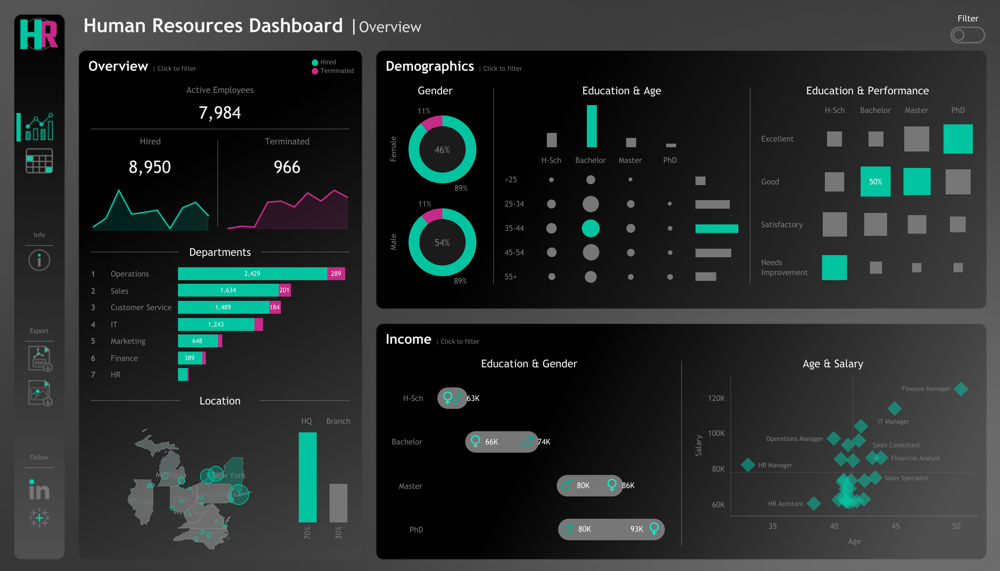

# 🧩 HR Analytics Dashboard | Tableau



---

## 📖 Project Description

The **HR Analytics Dashboard** is an interactive Tableau project designed to help HR departments and management teams make **data-driven decisions**.  
It visualizes key insights related to **hiring trends**, **employee demographics**, and **salary distribution** — giving a complete overview of workforce health and performance.

---

## 🎯 Objectives

- Track the company’s overall **workforce metrics** (hires, terminations, active employees).  
- Analyze **demographics** such as gender, age, and education.  
- Identify **salary trends and correlations** with education, gender, and department.  
- Empower HR professionals to make **strategic, data-backed decisions**.

---

## 📊 Dashboard Sections

### 🧍 Overview
- Displays **total hired**, **active**, and **terminated** employees.  
- Visualizes **hiring vs. termination trends** over the years.  
- Shows **department-wise** employee count and job title breakdown.  
- Compares employees between **Headquarters (New York)** and **branch locations**.  
- Maps employee **distribution by city and state**.

### 👥 Demographics
- Shows **gender ratio** across the organization.  
- Visualizes **age group** and **education level** distribution.  
- Displays **education vs. performance rating** relationships.  
- Helps understand workforce diversity and training needs.

### 💰 Income Analysis
- Compares **salaries across education levels** for both genders.  
- Shows how **age correlates with salary** within departments.  
- Identifies **pay gaps and compensation trends**.

---

## 📄 Employee Records View
Includes a detailed, filterable list of all employees with key attributes:
- Name | Department | Position | Gender | Age | Education | Salary  
Users can easily filter and sort based on any column to view specific employee groups.

---

## 🧠 Skills & Tools Used

| Category | Tools / Concepts |
|-----------|------------------|
| Data Visualization | Tableau Desktop |
| Data Preparation | CSV |
| Analytics Domain | HR Analytics & Workforce Insights |
| Techniques | KPI Tracking, Trend Analysis, Correlation Analysis |

---

## 🗂️ Repository Structure

(./Repository.png)


---

## 🚀 How to Use

1. **Clone or download** this repository:  
   ```bash
   git clone [https://github.com/](https://github.com/)<your-username>/HR-Analytics-Dashboard.git
